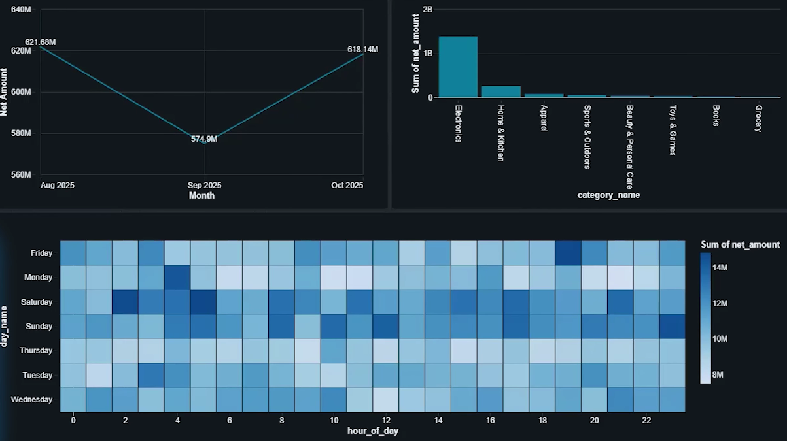

# End-to-End-E-Commerce-Data-Engineering-BI-Analytics-Platform
Production-style e-commerce lakehouse built with Databricks, AWS, PySpark, and Delta Lake, featuring Medallion Architecture, dimensional modeling, data pipelines, SQL analytics, and BI dashboards.

The project implements a Medallion Architecture (Bronze → Silver →
Gold) and separates processing into Dimension and Fact
pipelines before serving the curated data for analytics and BI
dashboards.

---------------------------------------------------------------------------------------------------------------------------

🚀 Project Overview

---------------------------------------------------------------------------------------------------------------------------

🛠️ Tech Stack

Databricks
AWS
Amazon S3
Unity Catalog
Apache Spark / PySpark
Delta Lake
SQL
Medallion Architecture
Dimensional Data Modeling
BI Dashboard / Analytics
Git / GitHub

---------------------------------------------------------------------------------------------------------------------------

⚙️ Setup

1. Create the Unity Catalog Schema

Create the source_data schema in the required catalog.

CREATE SCHEMA source_data;

The schema is used to organize the source/raw data assets for the
project.

2. Create the Raw Volume

Create a Unity Catalog volume named raw inside the source_data
schema.

CREATE VOLUME source_data.raw;

The volume is used as the storage location for the raw e-commerce files.

The resulting path is:

/Volumes/source_data/raw/

3. Configure AWS S3 Storage

The project uses AWS S3 as the cloud storage layer.

The S3 location is connected to Databricks through the appropriate
Unity Catalog External Location / Storage Credential configuration.

The raw e-commerce data is made available to Databricks and organized
under the Unity Catalog volume.

Do not commit AWS access keys, secret keys, Databricks tokens, or
other credentials to this repository.

4. Organize the Raw Data

The raw data is placed under the raw volume.

The project originally used the ecomm-raw-data location/folder. The
raw data folders were updated to use the raw volume structure.

Example:

/Volumes/source_data/raw/
├── customers/
├── products/
├── orders/
└── <other raw datasets>

The exact folders depend on the source dataset used for the project.

---------------------------------------------------------------------------------------------------------------------------

🔄 End-to-End Data Flow

                AWS S3
                  │
                  ▼
           Raw E-Commerce Data
                  │
                  ▼
       Unity Catalog / Raw Volume
                  │
          ┌───────┴────────┐
          │                │
          ▼                ▼
     DIM Pipeline      FACT Pipeline
          │                │
          ▼                ▼
    Bronze DIM          Bronze FACT
          │                │
          ▼                ▼
    Silver DIM          Silver FACT
          │                │
          ▼                ▼
     Gold DIM            Gold FACT
          └───────┬────────┘
                  │
                  ▼
            SQL Analytics
                  │
                  ▼
             BI Dashboard

---------------------------------------------------------------------------------------------------------------------------

📈 BI Dashboard & Analytics

The Gold layer provides the curated datasets used for business
intelligence and analytics.

The dashboard is designed to provide visibility into e-commerce business
performance.

Examples of analytical areas include:

Sales performance

Revenue analysis

Product performance

Customer analysis

Order analysis

Business KPIs

Trends and comparisons

BI Dashboard

Add dashboard screenshots to the bi_dashboard/ directory and display
the primary dashboard here:

---------------------------------------------------------------------------------------------------------------------------

🎯 Project Objectives

Build an end-to-end cloud data engineering pipeline.
Implement Medallion Architecture using Databricks and Delta
Lake.
Organize raw data using Unity Catalog Volumes.
Integrate AWS S3 with Databricks.
Separate analytical processing into Dimension and Fact
pipelines.
Transform raw data into analytics-ready Gold datasets.
Build SQL-based business analytics.
Develop a BI dashboard for business insights.

---------------------------------------------------------------------------------------------------------------------------

🔐 Security

Credentials and secrets are intentionally excluded from this repository.

Not committed:

AWS Access Keys
AWS Secret Keys
Databricks Tokens
Passwords
OAuth Credentials
.env files

Used Databricks secret management, environment variables, IAM roles,
other secure credential mechanisms.

---------------------------------------------------------------------------------------------------------------------------

📌 Project Status

Status: In Progress / Active Development

The core data engineering pipeline and BI analytics components are being
developed in Databricks.

Future extensions can include automated workflow orchestration, data
quality checks, ML/MLflow integration, and additional analytical use
cases.

---------------------------------------------------------------------------------------------------------------------------

👨‍💻 Author

Gaurav Bidaeet

Built as an end-to-end data engineering and BI analytics project using
Databricks and AWS.
